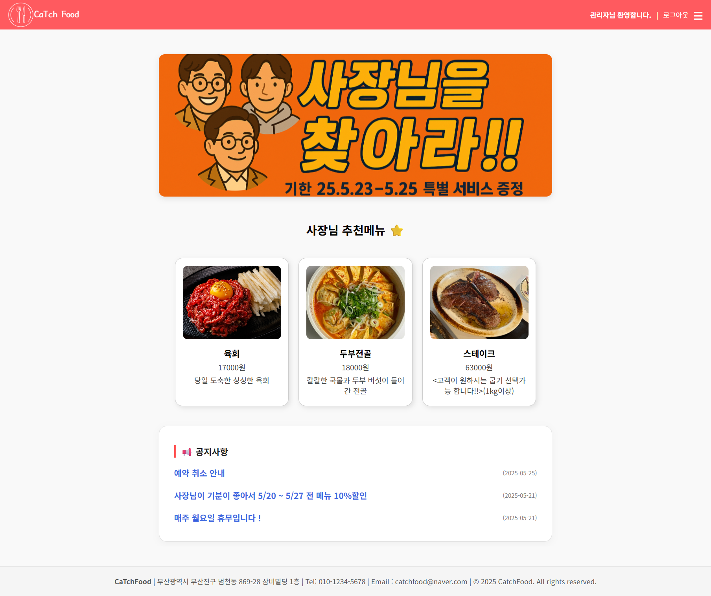
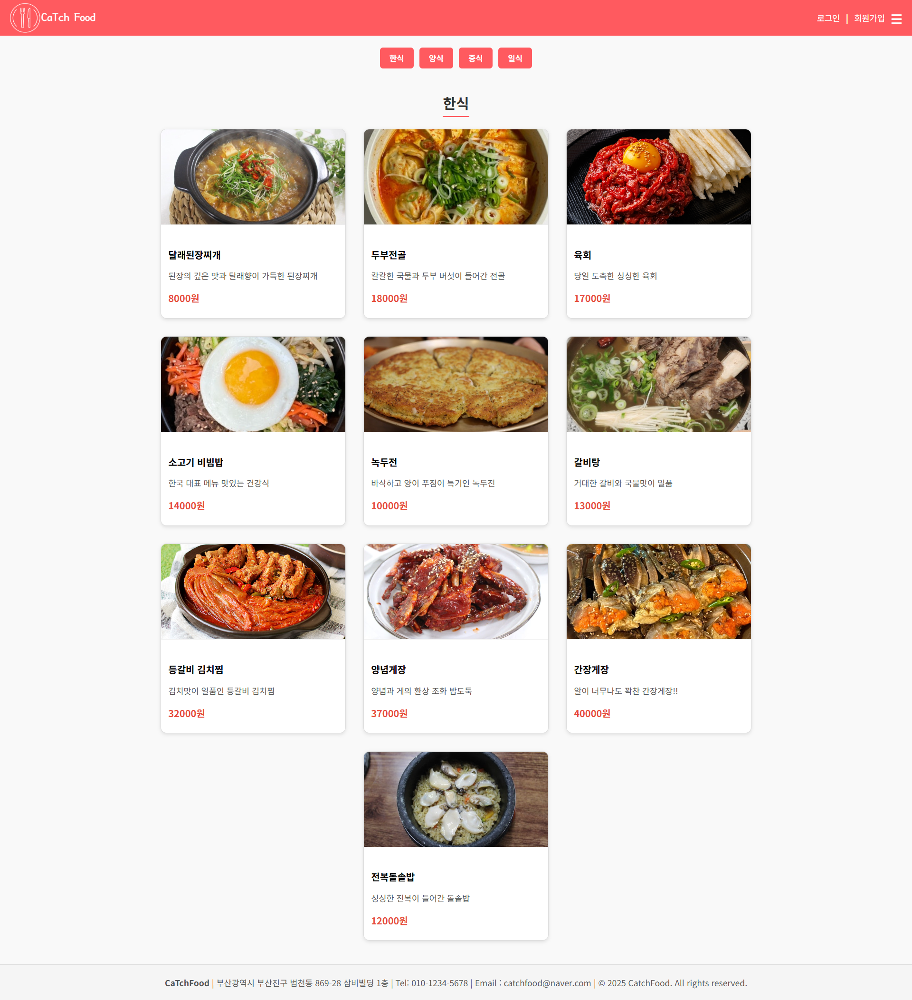
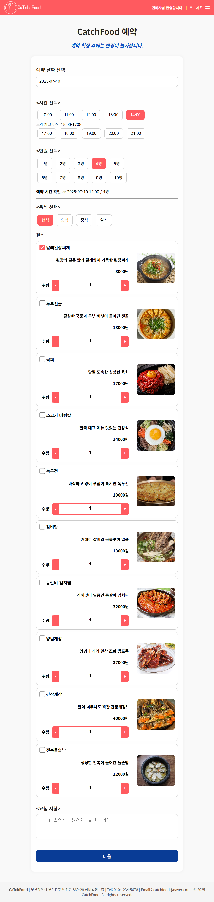
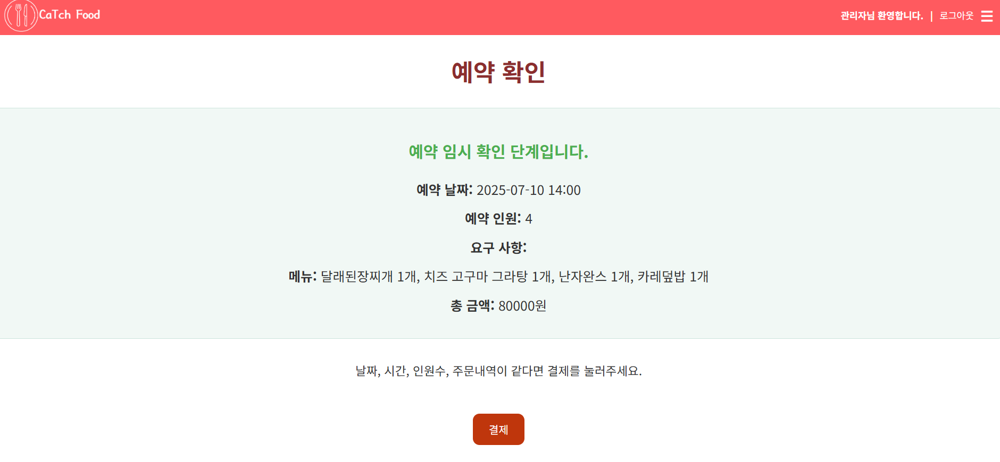
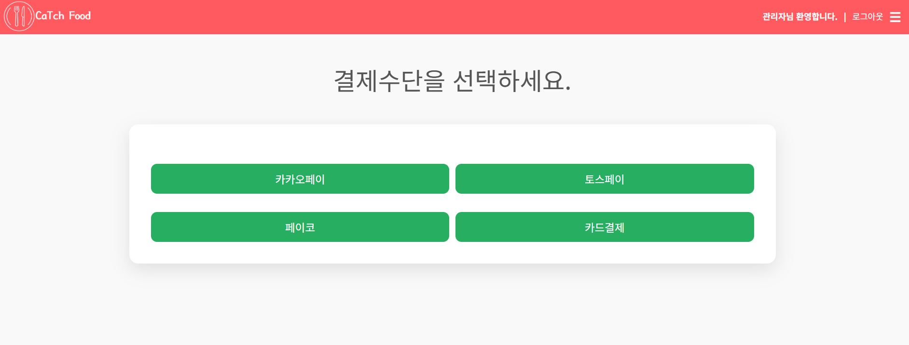
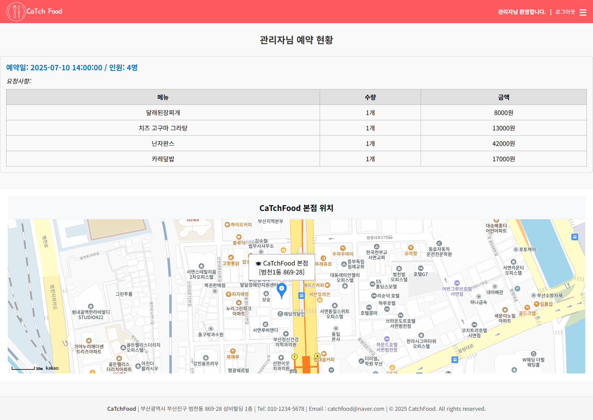
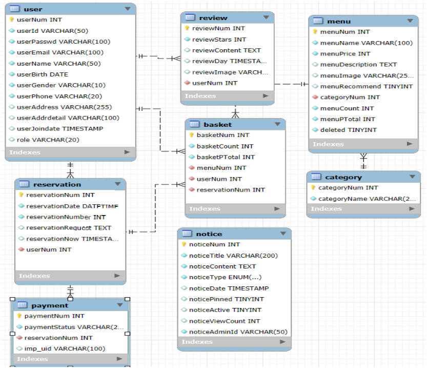

## 📌 프로젝트 이름

CatchFood - 음식점 예약 서비스

## 1️⃣ 프로젝트 개요

### 📚 소개
이 프로젝트는 사용자가 간편하게 음식점 메뉴를 선택하고, 시간과 인원을 지정하여 온라인으로 예약 및 결제까지 한 번에 진행할 수 있는 웹 서비스입니다

### 🛠️ 기술 스택
<ul>
  <li><b>Frontend</b>
    <ul>
      <li>JavaScript, HTML5, CSS3</li>
    </ul>
  </li>
  <li><b>Backend</b>
    <ul>
      <li>Java (JDK 21), JSP & Servlet, MyBatis</li>
    </ul>
  </li>
  <li><b>Framework / Library</b>
    <ul>
      <li>Spring Boot, Flatpickr, JavaMail</li>
    </ul>
  </li>
  <li><b>API / External Service</b>
    <ul>
      <li>Kakao Maps API, 행정안전부 공공 API, i’mport API</li>
    </ul>
  </li>
  <li><b>Database</b>
    <ul>
      <li>MySQL, ER Diagram</li>
    </ul>
  </li>
  <li><b>Tool / Environment</b>
    <ul>
      <li>Eclipse STS (Spring Tool Suite), MySQL Workbench, Windows 10, WAS (Apache Tomcat 10.1)</li>
    </ul>
  </li>
  <li><b>Collaboration</b>
    <ul>
      <li>GitHub</li>
    </ul>
  </li>
</ul>

### 👥 팀원 및 담당 역할
- **공통 역할**: DB설계, 메인화면
- **류지호**:예약 및 예약 임시 확인, 결제 페이지, 회원 및 예약 리스트(관리자)
- **박상준**: 리뷰, 공지사항 페이지, 예약 현황, 메뉴 작성 및 메뉴 리스트(관리자)
- **문민**: 회원가입/로그인, 내 정보수정, 자료 수집
 

## 2️⃣ 설치 및 실행 방법
### 📥 Git clone
    git clone https://github.com/catchFood-1/CatchFood
  
    cd CatchFood

### ⚙️ 환경설정
1️⃣ MySQL에 catchfood 데이터베이스를 생성합니다.

2️⃣ src/main/resources/application.properties 파일에 DB 접속 정보를 아래와 같이 설정합니다.

    spring.datasource.url=jdbc:mysql://localhost:3306/catchfood

    spring.datasource.username=DB_USERNAME

    spring.datasource.password=DB_PASSWORD

3️⃣ Kakao API Key 등 외부 서비스 키를 application.properties에 추가합니다.

    kakao.api.key=YOUR_KAKAO_API_KEY

### ▶️ 빌드 및 실행
아래 명령어로 애플리케이션을 빌드하고 실행합니다.

    ./gradlew build

    ./gradlew bootRun

✅ 실행 후 웹 브라우저에서 http://localhost:8080에 접속해 서비스를 확인하세요.

## 3️⃣ 주요 기능 및 화면
### ✨핵심 주요 기능
<ul> 
  <li><b>단일 음식점 예약 시스템</b> <ul> 
  <li>하루 단위 예약:  10:00~15:00, 17:00~21:00</li> 
  <li>날짜, 시간, 인원, 메뉴 선택 지원</li> 
  <li>결제 전 선택 내용 검토 가능</li>
</ul>
  </li>
  <li><b>메뉴 선택 및 장바구니</b> 
    <ul> 
      <li>메뉴 옆 체크박스와 수량 입력으로 다중 선택 가능</li>
      <li>선택한 메뉴 총 수량·총액 계산 후 장바구니에 담기</li> 
    </ul> 
  </li>
     <li>
       <b>결제 시스템</b> 
       <ul> 
         <li>아임포트 API 연동으로 결제 처리</li> 
         <li>결제 완료 후 예약 확정 및 DB 저장</li> 
       </ul> 
    </li>
<li>
  <b>추천 메뉴 및 리뷰</b> 
  <ul> 
    <li>추천메뉴와 관련 리뷰 출력</li> 
    <li>리뷰 별점, 댓글 작성, 목록 및 상세보기</li>
  </ul> 
</li> 
</ul>

### 💫 부가 주요 기능
<ul>
    <li><b>회원 기능</b>
  <ul>
      <li>회원가입, 로그인, 로그아웃</li>
      <li>아이디/비밀번호 찾기</li>
      <li>마이페이지(회원정보 수정, 예약내역 확인/취소)</li>
      <li>리뷰 작성</li>
    </ul>
    </li>
  </ul>
  
  <ul>
    <li><b>공지사항</b>
      <ul>
        <li>공지사항 목록, 등록, 상세보기, 수정, 삭제</li>
        <li>자동 순번, 페이징 처리 지원</li>
      </ul>
    </li>
  </ul>
  
  <ul>
    <li><b>관리자 기능</b>
      <ul>
        <li>공지사항 등록/수정/삭제</li>
        <li>메뉴 등록/수정/삭제 및 이미지 업로드</li>
        <li>회원 관리(상태 변경: 휴면, 정상, 탈퇴)</li>
        <li>예약 현황 관리</li>
      </ul>
    </li>
  </ul>
</ul>

### 🖥️ 화면 구현 설명

메인 화면

  -  CaTchFood 음식점의 첫 화면에서는 이벤트 배너, 사장님 추천 메뉴, 공지사항을 한눈에 확인할 수 있습니다.
  

메뉴 리스트

  -  회원과 비회원 모두 다양한 음식 메뉴를 카테고리별로 확인할 수 있습니다.
  

예약

  -  예약 과정은 단계적으로 진행되며 사용자가 날짜, 시간, 인원을 먼저 선택해야 메뉴를 선택할 수 있도록 안내됩니다. 
  

예약 검토

  -  예약 페이지에서 입력한 예약 정보와 주문 내역을 결제하기 전에 모든 사항을 다시 확인하도록 안내하는 단계입니다.
  

결제

  -  원하는 결제수단을 선택하고 결제를 완료하면 예약 정보가 저장됩니다.
  

예약 현황(회원)

  -  예약 현황에서는 예약 정보를 다시 확인할 수 있습니다.
  

## 4️⃣ DB 설계 및 API 정보
### 🗂️ ERD 이미지

ERD 이미지 보기

  

#### 🧩 테이블 설명
#### 1. user — 회원 정보 테이블
  - 사용자 번호, 아이디, 비밀번호, 이메일, 이름, 생년월일, 성별, 전화번호, 주소, 상세주소, 가입일, 권한(user/admin) 등을 저장합니다.

#### 2. reservation — 예약 정보 테이블
  - 예약 번호, 예약 일시, 예약 고유번호, 예약 요청사항, 예약 생성 시각, 예약자(userNum) 정보를 저장합니다.

#### 3. review — 리뷰 테이블
  - 리뷰 번호, 별점, 리뷰 내용, 작성일, 리뷰 이미지, 작성자(userNum) 정보를 저장합니다.

#### 4. menu — 메뉴 정보 테이블
  - 메뉴 번호, 메뉴명, 가격, 설명, 이미지 경로, 추천 여부, 카테고리 번호(categoryNum), 판매 수량, 총 판매액, 삭제 여부 등을 저장합니다.

#### 5. category — 메뉴 카테고리 테이블
  - 메뉴 카테고리 번호와 카테고리명을 저장해 메뉴 분류에 사용됩니다.

#### 6. basket — 장바구니 테이블
  - 장바구니 번호, 담긴 메뉴 수량, 메뉴 총액, 메뉴 번호(menuNum), 사용자 번호(userNum), 예약 번호(reservationNum) 정보를 저장합니다.

#### 7. notice — 공지사항 테이블
  - 공지 번호, 제목, 내용, 유형, 등록일, 상단 고정 여부, 활성화 여부, 조회수, 작성 관리자 ID 등의 정보를 저장합니다.

#### 8. payment — 결제 정보 테이블
  - 환불 처리 시 결제 상태를 기록하고 관리합니다.

## 5️⃣ 업데이트 및 버전 관리
 ### 📅 개발 기간
 2025.05.01 ~ 2025.05.26

### 주요 작업 내역

  - ERD 설계 및 DB 스키마 작성

  - 예약 기능 개발(예약 생성, 예약 확인/취소 기능)

  - 메뉴 선택 및 장바구니 기능 구현(체크박스/수량 선택 → 총액 계산 → 장바구니 저장)

  - 아임포트 API 연동을 통한 결제 처리 로직 구축

  - 메뉴 추천 기능 개발 및 추천메뉴-리뷰 연결 기능 구현

  - 공지사항 CRUD(등록, 수정, 삭제) 및 페이징 처리 구현

  - 리뷰 작성/조회 기능 개발 및 별점 기능 추가

  - 관리자 페이지 기능 개발(메뉴/회원/예약 관리)

  - 전체 UI 디자인 개선 및 사용자 편의성 향상

  - 주요 오류 수정 및 기능 안정화

## 6️⃣ PPT 자료
[👉 CaTch Food 자료 다운로드 (Google Drive)](https://docs.google.com/presentation/d/1HMx3AHhsaqDdEA4y3cJi3vF67PJmB1Ld/edit?usp=drive_link&ouid=101157712031739783570&rtpof=true&sd=true)
